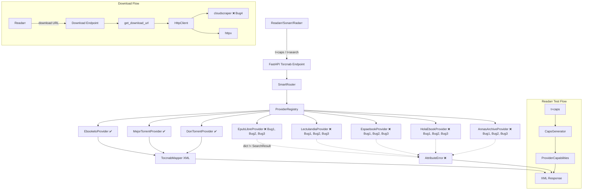

# WebTranslatorr - Análisis y Plan de Mejora Integral

## Resumen del Análisis

Tras revisar todos los módulos del proyecto, se han identificado **6 bugs críticos**, **4 problemas de alta prioridad** y **4 mejoras de media prioridad** que afectan directamente a la funcionalidad de WebTranslatorr.

---

## 🔴 BUGS CRÍTICOS (Impiden el funcionamiento correcto)

### Bug 1: Proveedores antiguos devuelven `dict` en lugar de `SearchResult`
**Archivos:** [`app/providers/books/epublibre.py`](app/providers/books/epublibre.py), [`lectulandia.py`](app/providers/books/lectulandia.py), [`espaebook.py`](app/providers/books/espaebook.py), [`holaebook.py`](app/providers/books/holaebook.py), [`annas_archive.py`](app/providers/books/annas_archive.py)

**Problema:** Los 5 providers "antiguos" (EpubLibre, Lectulandia, Espaebook, HolaEbook, AnnasArchive) implementan `search()` devolviendo `List[Dict[str, Any]]` con claves como `"id"`, `"title"`, `"guid"`. Sin embargo, el [`TorznabMapper._build_item()`](app/torznab/mapper.py:46) espera objetos con atributos (`result.title`, `result.guid`, `result.link`). Al recibir diccionarios, se produce un `AttributeError` silencioso y **Readarr recibe un XML vacío** (sin `<item>` tags), lo que hace que lo clasifique como "inoperativo".

**Solución:** Refactorizar los 5 providers para que usen el dataclass [`SearchResult`](app/core/models.py:10) igual que [`EbookeloProvider`](app/providers/books/ebookelo.py:142) y [`MejorTorrentProvider`](app/providers/video/mejortorrent.py:176).

---

### Bug 2: URLs de descarga construidas con `0.0.0.0` (local bound)
**Archivos:** [`epublibre.py:69`](app/providers/books/epublibre.py:69), [`lectulandia.py:65`](app/providers/books/lectulandia.py:65), [`espaebook.py:66`](app/providers/books/espaebook.py:66), [`holaebook.py:68`](app/providers/books/holaebook.py:68), [`annas_archive.py:68`](app/providers/books/annas_archive.py:68)

**Problema:** Los mismos 5 providers construyen el `link` de descarga como:
```python
f"{settings.HOST}:{settings.PORT}/api/download?provider=..."
```
Como `settings.HOST = "0.0.0.0"`, las URLs resultan en `0.0.0.0:9811/api/download?...`. Readarr no puede descargar desde `0.0.0.0`.

**Solución:** Añadir una configuración `EXTERNAL_URL` (ej: `http://localhost:9811`) o extraer dinámicamente la URL base de la request (`request.base_url`). Requiere pasar el request context o configurar el `external_url` globalmente.

---

### Bug 3: Discrepancia en firma de `search()`: `category` (int) vs `categories` (list)
**Archivos:** [`epublibre.py:27`](app/providers/books/epublibre.py:27), [`lectulandia.py:26`](app/providers/books/lectulandia.py:26), [`espaebook.py:25`](app/providers/books/espaebook.py:25), [`holaebook.py:26`](app/providers/books/holaebook.py:26), [`annas_archive.py:25`](app/providers/books/annas_archive.py:25)

**Problema:** Los providers antiguos esperan `category: int = None` (singular), pero el endpoint [`torznab.py:143`](app/api/torznab.py:143) pasa `categories=_parse_cats(cat)` (lista de ints). El parámetro `categories` cae en `**kwargs` y se ignora completamente, por lo que el filtrado por categoría no funciona para estos providers.

**Solución:** Unificar la firma de `search()` en TODOS los providers para que coincida con [`BaseProvider.search()`](app/providers/base.py:44) y la llamada desde [`torznab.py:142`](app/api/torznab.py:142).

---

### Bug 4: HttpClient devuelve `requests.Response` (cloudscraper) donde se espera `httpx.Response`
**Archivo:** [`app/scraping/http_client.py`](app/scraping/http_client.py)

**Problema:** Cuando se usa `use_scraper=True` (línea 60), `cloudscraper` devuelve `requests.Response`. Aunque se usa duck-typing básico (`.status_code`, `.text`, `.content`), hay diferencias importantes:
- `requests.Response.url` vs `httpx.Response.url` (son objetos diferentes)
- `raise_for_status()` funciona diferente entre librerías
- El manejo de encoding puede diferir

**Solución:** Estandarizar la respuesta: convertir `requests.Response` a un wrapper que exponga la misma interfaz que `httpx.Response`, o mejor aún, usar `httpx` con un transport layer que maneje Cloudflare (ej: `curl_cffi` o `cloudscraper` adaptado como transport).

---

### Bug 5: SmartRouter no filtra providers para búsquedas genéricas (`t=search`)
**Archivo:** [`app/routing/smart_router.py:51`](app/routing/smart_router.py:51)

**Problema:** Cuando Readarr hace `t=search&q=libro` (sin categoría explícita), [`smart_router.route()`](app/routing/smart_router.py:20) devuelve **TODOS** los providers registrados (libros + video). Esto significa que por cada búsqueda se consultan también MejorTorrent y DonTorrent, que pueden estar caídos, lentos, o devolver resultados irrelevantes. Además, si algún provider lanza excepción, el `asyncio.gather()` la captura pero ralentiza toda la respuesta.

**Solución:** El router debería inferir el tipo de contenido del query o incluir un mecanismo de "health check rápido" para excluir providers caídos. Alternativamente, agrupar por tipo de contenido y priorizar según el contexto de la búsqueda.

---

### Bug 6: `_resolve_imdb_to_spanish_title()` pasa `params` que `HttpClient.get()` no maneja explícitamente
**Archivo:** [`app/providers/video/mejortorrent.py:317`](app/providers/video/mejortorrent.py:317)

**Problema:** `http_client.get(tmdb_url, params=params)` pasa `params` como `**kwargs`. En [`HttpClient.get()`](app/scraping/http_client.py:43), esto se reenvía a `self._client.get(..., **kwargs)`. Aunque httpx soporta `params`, el código hace pop de `follow_redirects` y `use_scraper` de kwargs primero. Si `params` no causa problemas con httpx directamente, hay un caso borde: cuando `use_scraper=True`, los kwargs se pasan a `self._scraper.get(url, headers=headers, ...)` donde `params` NO es un parámetro válido de `requests.get` (usa `params` también... realmente sí lo acepta). Esto podría funcionar pero es frágil.

**Solución:** Hacer que `HttpClient.get()` acepte `params` como parámetro explícito junto con `headers`, `follow_redirects`, `use_scraper`, y `timeout`.

---

## 🟠 PROBLEMAS DE ALTA PRIORIDAD

### Issue 7: Dominios por defecto probablemente desactualizados
**Archivo:** [`config.py:24-33`](config.py:24-33)

Los dominios hardcodeados como `https://www42.mejortorrent.eu`, `https://epublibre.bid`, `https://ww3.lectulandia.co` cambian frecuentemente. El [`DomainResolver`](app/services/domain_resolver.py) intenta resolverlos dinámicamente, pero si las estrategias de privtree/telegram fallan, se queda con el dominio por defecto que puede estar muerto.

**Solución:** Mejorar la robustez del `DomainResolver` con más estrategias de fallback y logging más claro de qué dominio se está usando.

---

### Issue 8: Providers Elejandria y Gutenberg faltan (en configuración pero no implementados)
**Archivo:** [`config.py:17-18`](config.py:17-18), [`app/api/torznab.py:58-88`](app/api/torznab.py:58-88)

`ELEJANDRIA_ENABLED` y `GUTENBERG_ENABLED` existen en configuración pero no hay implementación de providers ni registro en `_init_providers()`. Además, sus dominios están en `config.py` pero no hay implementación real.

**Solución:** Implementar los providers o al menos eliminar las referencias muertas con logging de advertencia.

---

### Issue 9: Cache configurado pero no implementado
**Archivo:** [`config.py:44-45`](config.py:44-45)

`CACHE_ENABLED` y `CACHE_TTL_SECONDS` existen pero `cachetools` está en `requirements.txt` sin ser usado en ningún lado.

**Solución:** Implementar un cache decorator/interceptor para resultados de búsqueda, evitando rescraping de queries repetitivas.

---

### Issue 10: Sin soporte de proxy HTTP
**Archivo:** [`config.py:52`](config.py:52), [`app/scraping/http_client.py:26-30`](app/scraping/http_client.py:26-30)

`HTTP_PROXY` está configurado pero `HttpClient` no usa proxy en `httpx.AsyncClient()` ni en cloudscraper.

**Solución:** Pasar la configuración de proxy a ambos clients.

---

## 🟡 MEJORAS DE MEDIA PRIORIDAD

### Issue 11: `_last_request` en HttpClient crece sin límite
**Archivo:** [`app/scraping/http_client.py:34`](app/scraping/http_client.py:34)

El diccionario `_last_request: dict[str, float]` acumula entradas por cada dominio visitado sin limpieza. Con el tiempo puede crecer significativamente.

### Issue 12: `app/scraping/parser.py` no se usa
Archivo huérfano. Las funciones helper existen pero ningún provider las importa.

### Issue 13: MejorTorrentProvider tiene `limit` inline en `_parse_results` pero ignora `offset`/`limit` del endpoint
**Archivo:** [`mejortorrent.py:108`](app/providers/video/mejortorrent.py:108)
El `limit` se usa para limitar resultados después del enriquecimiento, pero el parsing inicial no tiene límite, lo que puede resultar en sobrecarga.

### Issue 14: Sin tests para providers individuales
Los tests existentes solo cubren `CategoryMapper`, `TorznabMapper` y asistencias básicas de routing. Ningún provider tiene tests.

---

## Diagrama de Arquitectura con Puntos de Falla



---

## Estrategia de Implementación

### Fase 1: Arreglar bugs críticos (Readarr test + búsquedas básicas)
1. Refactorizar providers antiguos → `SearchResult`
2. Arreglar URLs de descarga (external_url)
3. Unificar firma de `search()` en todos los providers
4. Estandarizar HttpClient

### Fase 2: Mejorar routing y robustez
5. Mejorar SmartRouter con filtrado inteligente
6. Endurecer manejo de errores en parallel gather
7. Mejorar DomainResolver con logging y fallbacks

### Fase 3: Completar funcionalidades faltantes
8. Implementar cache de resultados
9. Añadir soporte proxy HTTP
10. Implementar/stub providers faltantes (Elejandria, Gutenberg)

### Fase 4: Tests y documentación
11. Tests unitarios para providers
12. Tests de integración para el flujo Torznab completo
